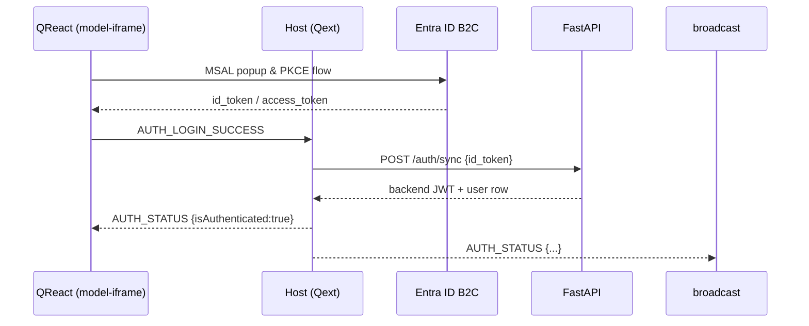
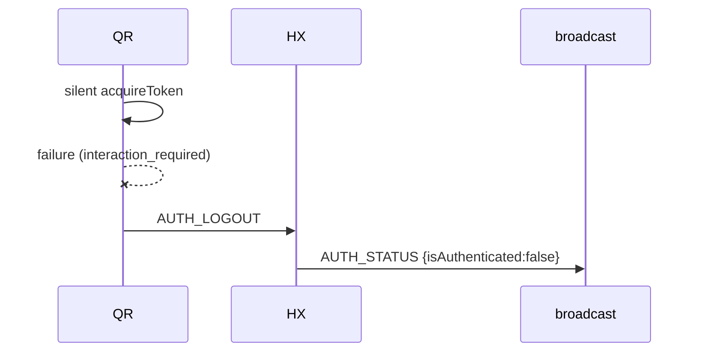
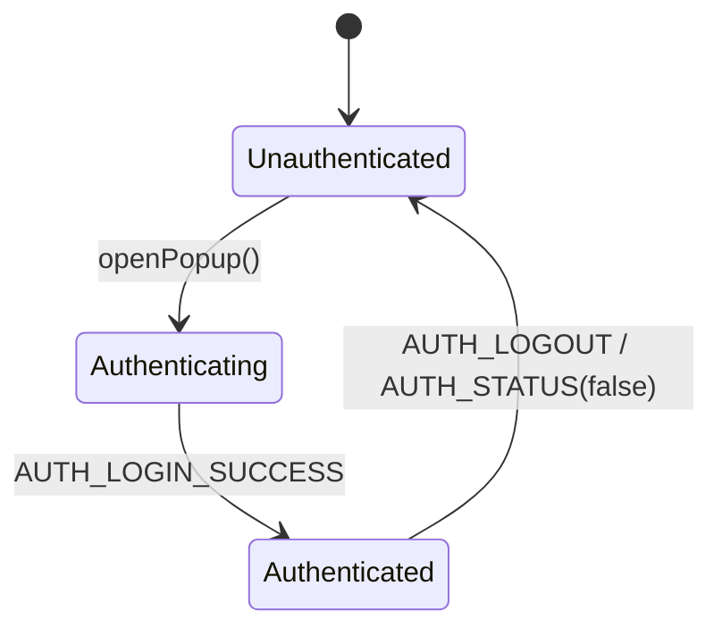

# Authentication Messages

This spec describes all message types related to user identity and session handling between the Quodsi extension host (**Qext**) and the React panels (**QReact**).  Authentication is powered by Microsoft Entra ID (B2C) on the client side and synchronized with the Quodsi FastAPI backend for session management.

> Every message inherits the standard envelope defined in `overview.md` ( `id`, `type`, `source`, `target`, `version`, `data` ).

---

## 1  Message Catalogue

| `type` constant           | Direction                 | Fired …                                                                                        | `data` payload                                          |
| ------------------------- | ------------------------- | ---------------------------------------------------------------------------------------------- | ------------------------------------------------------- |
| **`AUTH_LOGIN_SUCCESS`**  | `model‑iframe ► host`     | • After MSAL sign‑in **or** sign‑up finishes in popup.                                         | `{ idToken: string; user: UserInfo; newUser: boolean }` |
| **`AUTH_LOGOUT`**         | `model‑iframe ► host`     | • When user clicks **Sign Out**.<br>• When silent token refresh fails and panel forces logout. | `{}`                                                    |
| **`AUTH_PASSWORD_RESET`** | `model‑iframe ► host`     | • Successful completion of the B2C password‑reset flow.                                        | `{ email: string }`                                     |
| **`AUTH_STATUS`**         | `host ► any ready iframe` | • Immediately after `REACT_APP_READY`.<br>• Broadcast whenever login / logout occurs.          | `{ isAuthenticated: boolean; user?: UserInfo }`         |
| **`AUTH_REQUIRED`**       | `host ► model‑iframe`     | • Host blocks an operation because user is unauthenticated.                                    | `{ reason: "not_authenticated" \| "session_expired" }`  |
| **`AUTH_ERROR`**          | `any ► host`              | • Non‑PII auth failure (popup blocked, invalid token, etc.).                                   | `{ code: string; message: string }`                     |

### Helper Type

```ts
interface UserInfo {
  id: string;            // B2C objectId (sub)
  email: string;         // Primary sign‑in address
  displayName?: string;  // Friendly name (optional)
}
```

---

## 2  Sequence Diagrams

### 2.1  Sign‑in / Sign‑up (Happy Path)



### 2.2  Session Expiry → Logout



---

## 3  State Machine (Panel Side)



---

## 4  Error Handling Guidelines

* `AUTH_ERROR` **must never** leak PII.
* Host logs error to console **and** telemetry.
* For user‑facing feedback, panel maps `code` → toast / modal message.

---

## 5  Open Items / Future Work

1. Multi‑tenant support (`tenantId` claim)
2. Support for MFA‑required flows (B2C custom policies)
3. Token encryption at rest in host cache if browser Storage Access API becomes available.
