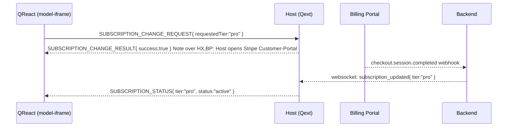
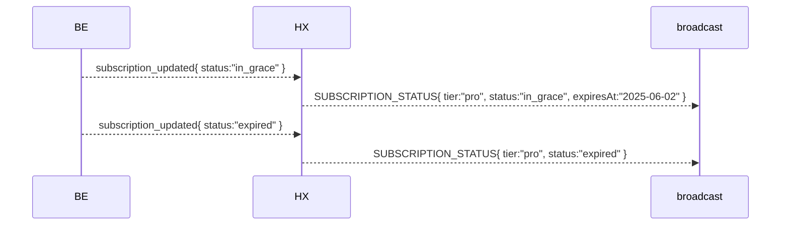

# Subscription & Billing Messages

Quodsi operates on a tiered subscription model (**Free**, **Pro**, **Enterprise**).  Users can self‑serve upgrades or downgrades from within the QReact UI, which launches an external billing portal (Stripe Customer‑Portal for MVP).  The following postMessage types keep QReact synchronized with the authoritative subscription state maintained by the Quodsi backend.

> All messages use the standard envelope documented in `overview.md`.

---

## 1  Message Catalogue

|  `type`                           | Direction               | Purpose                                                | Required `data` fields                                                       | Optional `data` fields                                               |
| --------------------------------- | ----------------------- | ------------------------------------------------------ | ---------------------------------------------------------------------------- | -------------------------------------------------------------------- |
| **`SUBSCRIPTION_STATUS`**         | host ► any ready iframe | Broadcast current tier & payment status                | `tier:"free"\|"pro"\|"enterprise"`, `status:"active"\|"in_grace"\|"expired"` | `expiresAt?: ISODateString`, `featureFlags?: Record<string,boolean>` |
| **`SUBSCRIPTION_CHANGE_REQUEST`** | iframe ► host           | User clicks Upgrade/Downgrade                          | `requestedTier:"pro"\|"enterprise"`                                          | `returnUrl?: string`                                                 |
| **`SUBSCRIPTION_CHANGE_RESULT`**  | host ► iframe           | Portal flow completed                                  | `success:boolean`                                                            | `tier?: string`, `errorMsg?: string`                                 |
| **`SUBSCRIPTION_ERROR`**          | host ► iframe           | Critical billing failure (payment lapse, account hold) | `code:string`, `message:string`                                              | —                                                                    |

---

## 2  Lifecycle Sequence Examples

### 2.1 Upgrade from Free → Pro

### 2.2 Payment Failure → Grace Period → Expired

---

## 3  Field Semantics

| Field          | Meaning                                                                                                                                   |
| -------------- | ----------------------------------------------------------------------------------------------------------------------------------------- |
| `tier`         | Commercial plan that controls feature gating.                                                                                             |
| `status`       | Billing health: **active** (paid), **in\_grace** (payment failed but grace period active), **expired** (features disabled until payment). |
| `expiresAt`    | ISO timestamp when grace period ends. Present only for `in_grace`.                                                                        |
| `featureFlags` | Optional dictionary pushed by backend to enable/disable fine‑grained features per tier.                                                   |

---

## 4  UI Handling Guidelines (informative)

* **Active** – all Pro/Enterprise features enabled.
* **In Grace** – features remain but UI shows payment‑issue banner with countdown.
* **Expired** – Pro/Enterprise features disabled; banner prompts to update payment.
* `SUBSCRIPTION_ERROR` should open a modal or toast with actionable steps ("Update card details", "Contact support").

---

## 5  Security & Compliance

* Billing portal URL is loaded in `noopener,noreferrer` popup to prevent window access.
* Webhooks are HMAC‑verified by backend before emitting `subscription_updated` to Host.
* Audit every subscription state transition in the **AuditLog** table (userId, oldStatus, newStatus, timestamp).

---

*Last updated: 2025‑05‑02*
