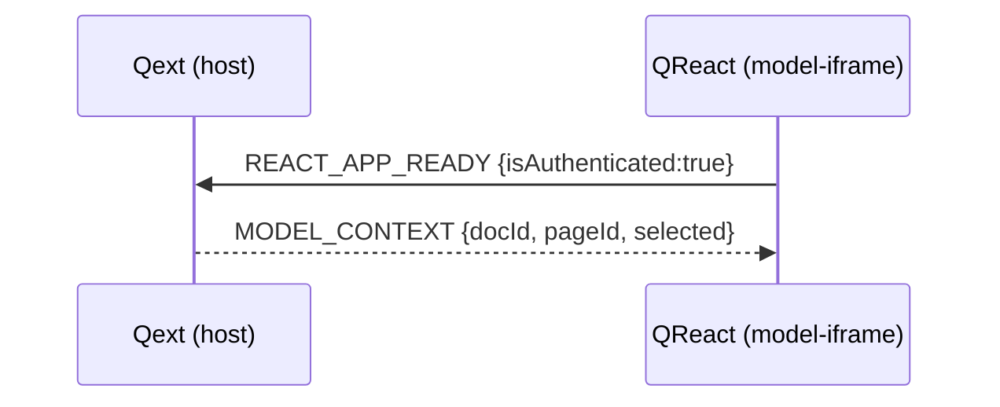
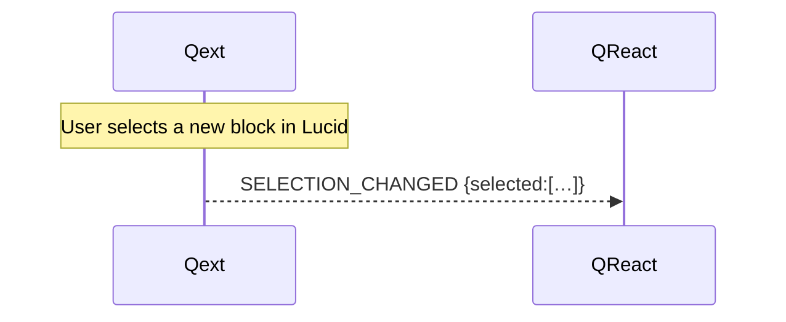

# Selection & Document Context Messages

This specification covers how LucidChart selection events and document context are communicated from the Quodsi extension host (**Qext**) to the model panel iframe (**QReact**), and vice‑versa.  These messages enable QReact to render the correct editor (conversion vs. object editor) and stay in sync even after panel reloads.

> **Envelope**: All messages use the common envelope defined in `overview.md`.

---

## 1  Message Catalogue

|  `type`                         | Direction     | Fired When                                                           | `data` fields                                                                                                                               |
| ------------------------------- | ------------- | -------------------------------------------------------------------- | ------------------------------------------------------------------------------------------------------------------------------------------- |
| **`MODEL_CONTEXT`**             | host → iframe | Panel becomes ready *and* user authenticated                         | <br>• `docId` `string`  – Lucid document GUID<br>• `pageId` `string` – Page GUID<br>• `selected` `SelectedItem[]` – Current selection (0–n) |
| **`SELECTION_CHANGED`**         | host → iframe | User changes Lucid selection                                         |  Same shape as `MODEL_CONTEXT` but only changed fields must be supplied (typically `selected`)                                              |
| **`REQUEST_SELECTION_CONTEXT`** | iframe → host | QReact requests the latest selection snapshot (e.g., panel reopened) |  `{}`                                                                                                                                       |

### 1.1  `SelectedItem` Interface

```ts
export interface SelectedItem {
  elementId: string;            // Lucid element GUID
  lucidType: "block" | "line" | "page";
  name?: string;                // Display label from Lucid
  isConverted: boolean;         // True if element is already a simulation object
  simObjectType?: "activity"|"entity"|"resource"|"connector"|"model"|"unknown";
  extra?: Record<string, unknown>; // Future geometry, metadata, etc.
}
```

---

## 2  Sequence Diagram – Initial Context Push



## 3  Sequence Diagram – Selection Update



## 4  Error Handling

If selection retrieval fails, host sends an `ERROR` message with `code:"selection_fetch_failed"`. QReact should keep the previous valid selection and surface a toast.

---

## 5  Versioning & Future Work

* Multi‑select is already supported via `selected.length > 1`.
* Geometry fields (`x`,`y`,`w`,`h`) may be added inside `extra` without breaking changes.
* In a future spec version, `lucidType:"group"` may be introduced.
