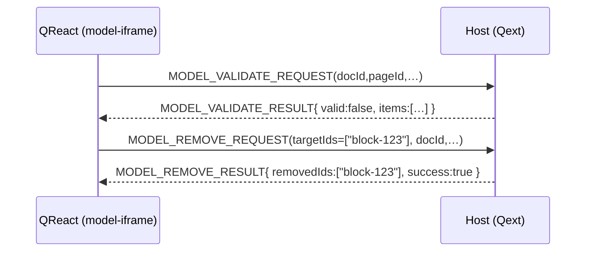
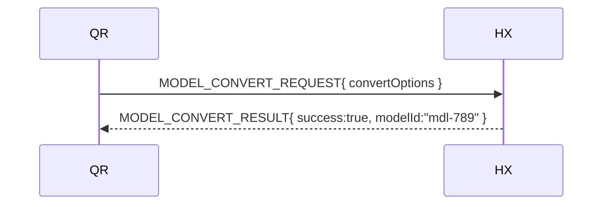

# Model‑Operations Messages

This file documents all messages that perform **structural actions on a LucidChart diagram or its associated Quodsi simulation model**.  These actions are distinct from running a simulation; they transform, validate, or clean up the model itself.

> Every message inherits the common envelope defined in `overview.md` (`id`, `type`, `source`, `target`, `version`, `data`).

---

## 1  Message Catalogue

|  `type`                           | Dir.          | Purpose                                                     | Required `data` fields                                      | Optional `data` fields                              |
| --------------------------------- | ------------- | ----------------------------------------------------------- | ----------------------------------------------------------- | --------------------------------------------------- |
| **`MODEL_VALIDATE_REQUEST`**      | iframe ► host | Ask Qext to run the validator on the current diagram/model. | `docId`, `pageId`, `selected: SelectedItem[]`               | —                                                   |
| **`MODEL_VALIDATE_RESULT`**       | host ► iframe | Returns validation outcome.                                 | `docId`, `valid:boolean`, `items: ValidationItem[]`         | —                                                   |
| **`MODEL_CONVERT_REQUEST`**       | iframe ► host | Convert diagram elements into a Quodsi model.               | `docId`, `pageId`, `convertOptions: Record<string,unknown>` | —                                                   |
| **`MODEL_CONVERT_RESULT`**        | host ► iframe | Conversion finished.                                        | `docId`, `success:boolean`                                  | `modelId`, `issues?: ValidationItem[]`, `errorMsg?` |
| **`MODEL_REMOVE_REQUEST`**        | iframe ► host | Delete a model or parts of it.                              | `docId`, `pageId`                                           | `targetIds?: string[]`                              |
| **`MODEL_REMOVE_RESULT`**         | host ► iframe | Removal done.                                               | `docId`, `removedIds: string[]`, `success:boolean`          | `errorMsg?`                                         |
| **`RESULTS_PAGE_CREATE_REQUEST`** | iframe ► host | Create a Lucid page with simulation charts.                 | `docId`, `jobId`                                            | `templateId?`                                       |
| **`RESULTS_PAGE_CREATE_RESULT`**  | host ► iframe | New page created or failed.                                 | `docId`, `pageId`, `success:boolean`                        | `errorMsg?`                                         |

*See `selection_context.md` for `SelectedItem` and `ValidationItem` helper types.*

---

## 2  Sequence Examples

### 2.1 Validate → Auto‑fix

### 2.2 Convert Diagram to Model

---

## 3  Error Handling

All failure scenarios return `success:false` and propagate an `errorMsg`.  Severe issues (e.g., validator crash) should also emit a top‑level `ERROR` message so the dev console captures stack traces.

---

## 4  Future Extensions

| Idea                        | Possible change                                                                |           |                                          |
| --------------------------- | ------------------------------------------------------------------------------ | --------- | ---------------------------------------- |
| **Batch operations**        | Allow `targetIds` to accept page‑level patterns (e.g., all orphan connectors). |           |                                          |
| **Partial convert**         | Introduce `MODEL_CONVERT_PROGRESS` if conversion ever takes >1 s.              |           |                                          |
| **Granular removal states** | Add \`state:"queued"                                                           | "running" | "completed"\` mirroring simulation runs. |

---

*Last updated: 2025‑05‑02*
