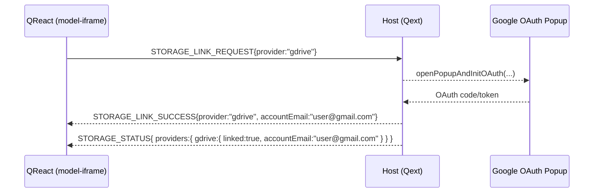

# Cloud‑Storage Linking Messages

Quodsi allows users to link external file‑storage providers—currently **Google Drive** and **Microsoft OneDrive**—to facilitate import/export of simulation data and results.  This document defines the postMessage interactions needed to set up, tear down, and query those links between **QReact** and the host **Qext**.

> The common envelope (`id`, `type`, `source`, `target`, `version`, `data`) is defined in `overview.md`.

---

## 1  Message Catalogue

|  `type`                      | Dir.          | Purpose                         | Required `data` fields                                 | Optional `data` fields |   |
| ---------------------------- | ------------- | ------------------------------- | ------------------------------------------------------ | ---------------------- | - |
| **`STORAGE_LINK_REQUEST`**   | iframe ► host | User starts OAuth flow.         | \`provider:"gdrive"                                    | "onedrive"\`           | — |
| **`STORAGE_LINK_SUCCESS`**   | host ► iframe | OAuth completed; tokens stored. | `provider`, `accountEmail`                             | `accountName`          |   |
| **`STORAGE_LINK_ERROR`**     | host ► iframe | OAuth failed or canceled.       | `provider`, `code`, `message`                          | —                      |   |
| **`STORAGE_UNLINK_REQUEST`** | iframe ► host | Disconnect account.             | `provider`                                             | —                      |   |
| **`STORAGE_UNLINK_SUCCESS`** | host ► iframe | Provider unlinked.              | `provider`                                             | —                      |   |
| **`STORAGE_STATUS`**         | host ► iframe | Current linkage snapshot.       | `providers:{ gdrive?:DriveInfo; onedrive?:DriveInfo }` | —                      |   |

```ts
type DriveInfo = {
  linked: boolean;
  accountEmail?: string;
  accountName?: string;
};
```

---

## 2  Typical Flow – Google Drive Link



*A subsequent disconnect emits `STORAGE_UNLINK_REQUEST` → `STORAGE_UNLINK_SUCCESS` and updates `STORAGE_STATUS`.*

---

## 3  Security Notes

* Tokens are stored **only in the backend**, not in browser storage, and are identified by opaque references.
* The host must restrict popup redirect URIs to `https://lucid.app` origins plus `localhost` in dev.
* `STORAGE_LINK_ERROR` should never include provider‑supplied PII or raw auth codes—log those server‑side.

---

## 4  Future Extensions

| Idea                   | Message/field impact                                                             |
| ---------------------- | -------------------------------------------------------------------------------- |
| **Dropbox support**    | Add `provider:"dropbox"` literal; no other changes.                              |
| **Quota info**         | Extend `DriveInfo` with `quotaTotal` and `quotaUsed`.                            |
| **Background refresh** | Host can push `STORAGE_STATUS` whenever backend detects token expiry or refresh. |

---

*Last updated: 2025‑05‑02*
