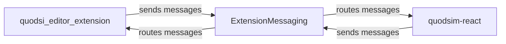

# Quodsi Messaging System

This document provides a comprehensive overview of the messaging system between the `quodsi_editor_extension` (LucidChart extension) and `quodsim-react` (React 18 application) components.

## Table of Contents

1. [Architecture Overview](#architecture-overview)
2. [Message Types](#message-types)
3. [Message Flow](#message-flow)
4. [Message Handlers](#message-handlers)
5. [Payload Structure](#payload-structure)
6. [Action-Based Communication](#action-based-communication)

## Architecture Overview

The messaging system facilitates communication between:

- **quodsi_editor_extension**: A LucidChart extension that interacts with the diagram editor
- **quodsim-react**: A React 18 application that provides the UI for model configuration and simulation

The system uses a centralized messaging pattern through the `ExtensionMessaging` class in the shared library. Messages are sent via the browser's `postMessage` API for cross-iframe communication.



## Message Types

The system uses a well-defined set of message types defined in `MessageTypes.ts`:

```typescript
export enum MessageTypes {
    // React App Lifecycle
    REACT_APP_READY = 'reactAppReady',
    AUTH = 'auth',
    SELECTION_CHANGED = 'selectionChanged',
    // Action Message Types
    ACTION_REQUEST = 'actionRequest',
    ACTION_RESPONSE = 'actionResponse',
    VALIDATION_RESULT = 'validationResult',
}
```

Each message type has a corresponding payload interface defined in the `MessagePayloads` interface.

## Message Flow

### Initialization Flow

1. The React application initializes and sends a `REACT_APP_READY` message
2. The extension responds with initial state information
3. Authentication state is established through `AUTH` messages

### Typical User Interaction Flow

1. User selects an item in the LucidChart editor
2. Extension sends `SELECTION_CHANGED` message with details about the selection
3. React app updates its UI based on the selection
4. User makes changes in the React app
5. React app sends `ACTION_REQUEST` messages for specific operations
6. Extension performs the requested operations and sends `ACTION_RESPONSE` messages

## Message Handlers

### Extension Side Handlers

The extension uses a specialized `ActionMessageHandler` class to process incoming action requests:

- Handles all `ACTION_REQUEST` messages
- Routes requests to appropriate handler methods based on `actionType`
- Sends `ACTION_RESPONSE` messages back to the React app

### React Side Handlers

The React application uses a more modular approach:

- `messageHandlers.ts` - Registers handlers for all message types
- `selectionMessageHandlers.ts` - Handles selection-related messages
- `authMessageHandlers.ts` - Handles authentication-related messages
- `actionRequestHandlers.ts` - Prepares and sends action requests
- `actionResponseHandlers.ts` - Processes action responses

## Payload Structure

All messages follow a consistent structure:

```typescript
export type Message<T extends MessageTypes> = {
    messagetype: T;
    data: MessagePayloads[T];
}
```

### Notable Payload Types

#### Selection Changed Payload

```typescript
export interface SelectionChangedPayload {
    selectionType: SelectionType;
    selectionState: SelectionState;
    validationResult?: ValidationResult;
    documentId: string;
    diagramElementType?: DiagramElementType;
    modelItemData?: ModelItemData | ModelItemData[];
    referenceData?: EditorReferenceData;
    hasModel?: boolean;
    elementId?: string;
    isProcessing?: boolean;
    error?: string;
    errorDetails?: JsonSerializable;
}
```

#### Auth Payload

```typescript
export interface AuthPayloads {
    [MessageTypes.AUTH]: {
        type: AuthActionType;
        data?: {
            panelType?: 'auth' | 'model';
            isAuthenticated?: boolean;
            userInfo?: UserInfo;
            redirectUri?: string;
            success?: boolean;
            error?: string;
            errorCode?: string;
            errorDescription?: string;
            reason?: string;
        };
    };
}
```

## Action-Based Communication

The system uses a unified action-based approach for operational requests and responses.

### Action Types

```typescript
export enum ActionType {
    // Model actions
    CONVERT_PAGE = 'convertPage',
    REMOVE_MODEL = 'removeModel',

    // Element actions
    UPDATE_ELEMENT_DATA = 'updateElementData',
    CONVERT_ELEMENT = 'convertElement',

    // Validation actions
    VALIDATE_MODEL = 'validateModel',

    // Simulation actions
    SIMULATE_MODEL = 'simulateModel',
    SIMULATION_STATUS_CHECK = 'simulationStatusCheck',
    CREATE_RESULTS_PAGE = 'createResultsPage',
    VIEW_SIMULATION_RESULTS = 'viewSimulationResults',
    MARK_RESULTS_VIEWED = 'markResultsViewed'
}
```

### Action Request Pattern

1. React app creates an action request with specific `actionType` and `data`
2. Extension processes the request and performs the operation
3. Extension sends an action response with:
   - The same `actionType` to identify the operation
   - A `success` flag indicating the outcome
   - Optional `data` with operation-specific results

### Request and Response Formats

#### Action Request

```typescript
export interface ActionRequest extends ActionBase {
    data?: ActionRequestData;
}
```

#### Action Response

```typescript
export interface ActionResponse extends ActionBase {
    success: boolean;
    data?: ActionResponseData;
}
```

## Implementation Details

### ExtensionMessaging Class

The `ExtensionMessaging` class provides the core messaging infrastructure:

```typescript
export class ExtensionMessaging {
    // Singleton instance
    private static instance: ExtensionMessaging;
    private handlers: Map<MessageTypes, Set<(payload: any) => void>> = new Map();

    // Get the singleton instance
    public static getInstance(): ExtensionMessaging { ... }

    // Handle incoming messages
    public handleIncomingMessage(message: any): void { ... }

    // Register message handlers
    public onMessage<T extends MessageTypes>(
        type: T,
        handler: (payload: MessagePayloads[T]) => void
    ): () => void { ... }

    // Send messages
    public sendMessage<T extends MessageTypes>(
        type: T,
        payload?: MessagePayloads[T]
    ): void { ... }
}
```

### Handler Registration

In the React application, handlers are registered during initialization:

```typescript
export function registerMessageHandlers(
    messaging: ExtensionMessaging,
    deps: MessageHandlerDependencies
): void {
    (Object.entries(messageHandlers) as [MessageTypes, MessageHandler<MessageTypes>][])
        .forEach(([type, handler]) => {
            registerHandler(messaging, type, handler, deps);
        });
}
```

## Best Practices

1. **Use Strongly-Typed Payloads**: All message payloads should follow the defined interfaces
2. **Centralize Message Handling**: Route messages through the appropriate handlers
3. **Consistent Error Handling**: Always include error information in responses
4. **State Updates**: Update application state based on message processing
5. **Logging**: Include comprehensive logging for debugging

## Common Messaging Patterns

### Selection Changed

```typescript
// Extension side
this.messaging.sendMessage(MessageTypes.SELECTION_CHANGED, {
    selectionType: SelectionType.ELEMENT,
    selectionState: selectionState,
    documentId: documentId,
    modelItemData: modelItemData
});

// React side handler
[MessageTypes.SELECTION_CHANGED]: (payload, { setState }) => {
    // Update state based on selection
    setState(prev => ({
        ...prev,
        currentElement: payload.modelItemData
    }));
}
```

### Action Request & Response

```typescript
// React side request
sendActionRequest(
    deps,
    ActionType.VALIDATE_MODEL,
    { documentId: currentDocumentId }
);

// Extension side handler
private async handleValidateModel(request: ActionRequest): Promise<void> {
    const validationResult = await this.modelManager.validateModel();
    
    this.sendActionResponse(request.actionType, true, {
        validationResult
    });
}

// React side response handler
[ActionType.VALIDATE_MODEL]: (payload, { setState }) => {
    if (payload.success && payload.data?.validationResult) {
        setState(prev => ({
            ...prev,
            validationState: {
                summary: {
                    errorCount: payload.data.validationResult.errorCount,
                    warningCount: payload.data.validationResult.warningCount
                },
                messages: payload.data.validationResult.messages
            }
        }));
    }
}
```

## Debugging Tips

1. Check browser console logs - messages are logged extensively
2. Verify message types match the expected format
3. Ensure payload structures follow the defined interfaces
4. Look for mismatches between sender and receiver expectations
5. Verify that action types are consistent between requests and responses

---

For more detailed information, refer to the source code in:
- `quodsi_lucidchart_package/shared/src/types/messaging/`
- `quodsi_lucidchart_package/editorextensions/quodsi_editor_extension/src/handlers`
- `quodsi_lucidchart_package/editorextensions/quodsi_editor_extension/quodsim-react/src/services/messageHandlers`
