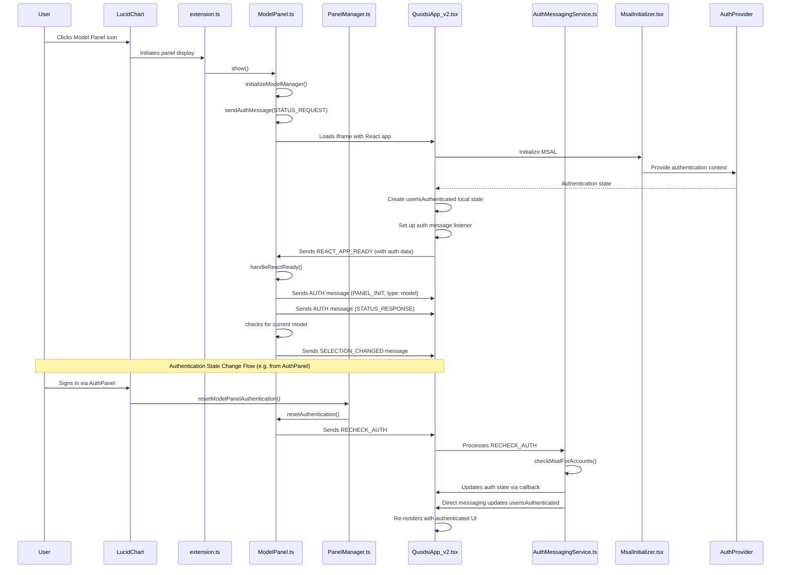

# ModelPanel to REACT_APP_READY Flow

This document describes the application code flow starting with `extension.ts` and the user clicking to show the ModelPanel, leading to QuodsiApp.tsx sending the REACT_APP_READY message and the handling by the ModelPanel.

## Flow Diagram



## Detailed Process

### 1. Extension Initialization

When the LucidChart extension first loads, `extension.ts` initializes the ModelPanel:

```typescript
console.info('[extension] About to create ModelPanel');
const modelPanel = new ModelPanel(client, modelManager);
modelPanel.setLogging(true);
console.info('[extension] Created ModelPanel');

// Register with panel manager for cross-panel communication
panelManager.registerModelPanel(modelPanel);
```

The ModelPanel constructor sets up basic configuration and initializes properties:

```typescript
constructor(client: EditorClient, modelManager: ModelManager) {
    super(client, {
        title: 'Quodsi Model',
        url: 'quodsim-react/index.html',
        location: PanelLocation.RightDock,
        iconUrl: 'https://lucid.app/favicon.ico',
        width: 300
    });
    this.versionManager = new LucidVersionManager();
    // Initialize services and managers but don't perform any operations yet
    this.messaging = ExtensionMessaging.getInstance();
    this.modelManager = modelManager;
    this.selectionManager = new SelectionManager(
        modelManager,
        <T extends MessageTypes>(type: T, payload?: MessagePayloads[T]) => {
            this.sendTypedMessage(type, payload);
        }
    );
    // Set up event handlers
    this.setupModelMessageHandlers();
    this.log('Model Panel initialized');
}
```

### 2. User Clicks Model Panel Icon

When the user clicks the Model Panel icon in the LucidChart panel selector:

1. LucidChart initiates the panel display by calling the `show()` method
   ```typescript
   public show(): void {
       this.log('Show called');
       const viewport = new Viewport(this.client);
       const currentPage = viewport.getCurrentPage();
       this.log('Current page at show:', currentPage);

       // Request current auth status when panel is shown
       this.sendAuthMessage(AuthActionType.STATUS_REQUEST);
       this.initializeModelManager(); // Re-initialize when panel is shown
       super.show();
   }
   ```

2. The ModelPanel immediately requests the current authentication status and initializes the model manager
3. The ModelPanel loads its iframe content pointing to the React application:
   ```typescript
   super(client, {
       title: 'Quodsi Model',
       url: 'quodsim-react/index.html',
       location: PanelLocation.RightDock,
       iconUrl: 'https://lucid.app/favicon.ico',
       width: 300
   });
   ```

4. The ModelPanel's `frameLoaded()` method is called once the iframe has been constructed and loaded

### 3. Model Manager Initialization

When the ModelPanel is shown, it attempts to initialize the model manager:

```typescript
private async initializeModelManager(): Promise<void> {
    const viewport = new Viewport(this.client);
    const currentPage = viewport.getCurrentPage();

    if (!currentPage || !this.modelManager.isQuodsiModel(currentPage)) {
        this.log('Page is not a Quodsi model, skipping initialization');
        return;
    }

    try {
        const modelData = this.modelManager.getElementData<Model>(currentPage);
        if (modelData) {
            await this.modelManager.initializeModel(modelData, currentPage);
            this.log('Model initialization complete');
        }
    } catch (error) {
        this.logError('Error initializing model:', error);
        throw new Error(`Failed to initialize model: ${error instanceof Error ? error.message : 'Unknown error'}`);
    }
}
```

This attempts to:
1. Check if the current page is a Quodsi model
2. If it is, get the model data from the page
3. Initialize the model with the data

If the current page is not a Quodsi model, the model manager will be initialized later when the React app is ready.

### 4. React Application Initialization

The React application loads with the initialization sequence covered in the common initialization flow document. Key components for the ModelPanel include:

1. **App.tsx**: Entry point that sets up the authentication providers
2. **MsalInitializer.tsx**: Ensures MSAL is properly initialized before rendering children
3. **AuthProvider.tsx**: Provides authentication context to all components
4. **QuodsiApp_v2.tsx**: Main application component that determines which panel it's in and renders accordingly

During initialization, QuodsiApp_v2.tsx attempts to determine which panel it's running in:

```typescript
// Default to model panel if not explicitly an auth panel
panelType: window.location.pathname.includes("auth") ? "auth" : null,

// Effect to try to detect panel type from URL parameters
useEffect(() => {
  // Only run if panelType is not set yet
  if (!state.panelType) {
    try {
      // Try to determine panel type from URL search params
      const urlParams = new URLSearchParams(window.location.search);
      const panelParam = urlParams.get("panel");

      if (panelParam) {
        // If panel parameter exists, use it
        const detectedType = panelParam.toLowerCase() === "auth" ? "auth" : "model";
        console.log(`[QuodsiApp_v2] Detected panel type '${detectedType}' from URL parameter`);

        setState((prev) => ({ ...prev, panelType: detectedType }));
      } else if (window.location.pathname.includes("auth")) {
        // Fallback to checking URL path
        console.log("[QuodsiApp_v2] Detected auth panel from URL path");
        setState((prev) => ({ ...prev, panelType: "auth" }));
      } else {
        // Default to model panel if we can't determine
        console.log("[QuodsiApp_v2] Defaulting to model panel");
        setState((prev) => ({ ...prev, panelType: "model" }));
      }
    } catch (error) {
      console.error("[QuodsiApp_v2] Error detecting panel type:", error);
    }
  }
}, []); // Only run once on mount
```

Since this is the ModelPanel, the application typically resolves to `panelType: "model"`.

### 5. Local Authentication State in React

The QuodsiApp_v2 component sets up local authentication state separate from the context:

```typescript
// Get authentication state from context
const { isAuthenticated, userInfo } = useAuth();

// Set up local authentication state
const [userIsAuthenticated, setUserIsAuthenticated] = useState<boolean>(false);
const [localUserInfo, setLocalUserInfo] = useState<any>(null);

// Sync the auth context state to local state
useEffect(() => {
  if (isAuthenticated && userInfo) {
    console.log("[QuodsiApp_v2] Auth context updated to authenticated, syncing local state");
    setUserIsAuthenticated(true);
    setLocalUserInfo(userInfo);
  }
}, [isAuthenticated, userInfo]);
```

It also sets up a direct message handler for authentication updates:

```typescript
// Add an effect to handle auth updates from messaging
useEffect(() => {
  // Create a handler for AUTH messages to directly update local state
  const handleAuthMessage = (message: any) => {
    // Only process messages from our messaging library
    if (!message || !message.data || !message.data.messagetype) {
      return;
    }

    // Check for AUTH message with status response
    if (
      message.data.messagetype === "AUTH" &&
      message.data.data?.type === "status_response" &&
      message.data.data?.data?.isAuthenticated
    ) {
      console.log("[QuodsiApp_v2] Received direct AUTH update:", message.data.data.data);

      // Update local state directly
      setUserIsAuthenticated(true);
      setLocalUserInfo(message.data.data.data.userInfo || null);
    }
  };

  // Listen for messages
  window.addEventListener("message", handleAuthMessage);

  // Clean up
  return () => {
    window.removeEventListener("message", handleAuthMessage);
  };
}, []);
```

### 6. REACT_APP_READY Message

Once the React application is initialized, QuodsiApp_v2.tsx sends the `REACT_APP_READY` message with authentication data:

```typescript
// Create the authentication data to include with REACT_APP_READY
const authData = {
  panelType: state.panelType || undefined,
  isAuthenticated: isAuthenticated,
  userInfo: userInfo || undefined,
};

// Send the REACT_APP_READY message with auth data
messageService.current.sendAppReadyMessage(authData);
```

The actual message sending is implemented in the MessageService:

```typescript
public sendAppReadyMessage(authData: any): void {
  ComponentLogger.log(LOG_PREFIX, 'Sending REACT_APP_READY with auth data:', {
    panelType: authData.panelType || undefined,
    isAuthenticated: authData.isAuthenticated,
    hasUserInfo: !!authData.userInfo,
  });

  this.sendMessage(MessageTypes.REACT_APP_READY, authData);
}
```

### 7. ModelPanel Receives REACT_APP_READY

The ModelPanel has a handler set up to process `REACT_APP_READY` messages with authentication data:

```typescript
this.messaging.onMessage(MessageTypes.REACT_APP_READY, (payload) => {
    this.log('REACT_APP_READY message received in ModelPanel with payload:', payload);
    
    // Check if the message includes authentication data
    if (payload && typeof payload.isAuthenticated === 'boolean') {
        this.log('Received auth state from React app:', {
            isAuthenticated: payload.isAuthenticated,
            hasUserInfo: !!payload.userInfo
        });
        
        // Update our authentication state if needed
        if (payload.isAuthenticated) {
            this.log('Updating panel auth state from React app');
            this.isAuthenticated = payload.isAuthenticated;
            this.userInfo = payload.userInfo || null;
        }
    }
    
    this.handleReactReady();
});
```

### 8. ModelPanel handleReactReady()

Once the ModelPanel processes the `REACT_APP_READY` message, it calls `handleReactReady()`:

```typescript
private async handleReactReady(payload: AuthData): Promise<void> {
    this.log('REACT_APP_READY message received in ModelPanel with payload:', payload);

    // Check if the message includes authentication data
    if (payload && typeof payload.isAuthenticated === 'boolean') {
        // Update our authentication state
        this.isAuthenticated = payload.isAuthenticated;
        this.userInfo = payload.isAuthenticated ? (payload.userInfo || null) : null;

        try {
            this.reactAppReady = true;
            this.selectionManager.setReactAppReady(true);

            // Always send PANEL_INIT message regardless of authentication state
            this.sendAuthMessage(AuthActionType.PANEL_INIT, {
                panelType: 'model'
            });

            // If user is authenticated, proceed with full initialization
            if (this.isAuthenticated) {
                const viewport = new Viewport(this.client);
                // Initialize the model manager
                await this.initializeModelManager();

                // Get current selection state and send appropriate message
                const selectedItems = viewport.getSelectedItems();
                this.log('handleReactReady: handleSelectionChange');
                await this.handleSelectionChange(selectedItems);
            } else {
                // User is not authenticated - send a status response to tell React app
                // This will trigger the "Sign In" UI to be shown
                this.sendAuthMessage(AuthActionType.STATUS_RESPONSE, {
                    isAuthenticated: false,
                    userInfo: null
                });

                // Also send a base selection message to properly update React's state
                // This ensures isLoading is set to false by giving React a selection state
                this.sendTypedMessage(MessageTypes.SELECTION_CHANGED, {
                    selectionType: SelectionType.NONE,
                    documentId: new DocumentProxy(this.client).id,
                    hasModel: false,
                    selectionState: {
                        pageId: '',
                        selectedIds: [],
                        selectionType: SelectionType.NONE
                    }
                });
            }
        } catch (error) {
            this.handleActionResponseError('Error during React ready initialization: ', error);
        }
    }
}
```

This method performs several important steps:

1. Sets `reactAppReady` to true and informs the selection manager
2. Sends an `AUTH` message with `PANEL_INIT` action type - tells React this is the ModelPanel
3. Checks authentication state:
   - If authenticated, initializes the model manager and sends selection updates
   - If not authenticated, sends authentication and selection state for proper UI rendering

### 9. Authentication State Change Flow

When a user signs in via the AuthPanel, a sequence of events updates the ModelPanel's authentication state:

1. **AuthPanel Notifies PanelManager**:
   ```typescript
   // In AuthPanel.ts, handleAuthCompleted()
   if (data.success) {
       this.saveSessionState();
       // Notify ModelPanel of authentication state change via PanelManager
       panelManager.resetModelPanelAuthentication();
       // Other code...
   }
   ```

2. **PanelManager Calls ModelPanel's resetAuthentication**:
   ```typescript
   // In PanelManager.ts
   public resetModelPanelAuthentication(): void {
       console.log('[PanelManager] Resetting authentication in ModelPanel');

       if (this._modelPanel) {
           this._modelPanel.resetAuthentication();
       }
   }
   ```

3. **ModelPanel Sends RECHECK_AUTH to React**:
   ```typescript
   // In ModelPanel.ts
   public resetAuthentication(): void {
       this.log('Resetting authentication state');
       this.reactAppReady = false;
       
       // Send RECHECK_AUTH to react instance
       this.log('sendAuthMessage RECHECK_AUTH');
       this.sendAuthMessage(AuthActionType.RECHECK_AUTH, {
           panelType: 'model'
       });
   }
   ```

4. **AuthMessagingService Handles RECHECK_AUTH**:
   ```typescript
   // In AuthMessagingService.ts
   private handleRecheckAuth(): void {
       ComponentLogger.log(LOG_PREFIX, 'Handling RECHECK_AUTH message');
       
       // Get MSAL instance
       const msalInstance = getMsalInstanceFromContext();
       if (!msalInstance) return;
       
       // Check for existing accounts
       const currentAccounts = msalInstance.getAllAccounts();
       
       if (currentAccounts.length > 0) {
           // User is authenticated, create user info
           const account = currentAccounts[0];
           const userInfo = {
               name: account.name || "Unknown User",
               email: account.username,
           };
           
           // Update global auth state via callback
           if (this.authStateUpdateCallback) {
               this.authStateUpdateCallback(true, userInfo);
           }
           
           // Broadcast auth status to extension
           this.broadcastAuthStatus(true, userInfo);
       } else {
           // No accounts found, user not authenticated
           if (this.authStateUpdateCallback) {
               this.authStateUpdateCallback(false, null);
           }
           
           this.broadcastAuthStatus(false, null);
       }
   }
   ```

5. **Auth Update Callback in useAuthentication**:
   ```typescript
   // In useAuthentication.ts
   useEffect(() => {
       // Register callback to handle auth state updates from messaging service
       authMessagingService.onAuthStateUpdate((isAuthenticated, userInfo) => {
           console.log("[useAuthentication] Updating global auth state from messaging:", 
               { isAuthenticated, userInfo });
           
           // Update the state
           setIsAuthenticated(isAuthenticated);
           setUserInfo(userInfo);
       });
       
       // Other effect code...
   }, [/* dependencies */]);
   ```

6. **QuodsiApp_v2 Direct Message Handler**:
   ```typescript
   // In QuodsiApp_v2.tsx
   useEffect(() => {
       const handleAuthMessage = (message: any) => {
           // Check for AUTH message with status response
           if (message.data?.messagetype === "AUTH" &&
               message.data.data?.type === "status_response" &&
               message.data.data?.data?.isAuthenticated) {
               
               // Update local state directly
               setUserIsAuthenticated(true);
               setLocalUserInfo(message.data.data.data.userInfo || null);
           }
       };
       
       window.addEventListener("message", handleAuthMessage);
       // Rest of code...
   }, []);
   ```

7. **QuodsiApp_v2 Re-renders with Authenticated UI**:
   ```typescript
   // UI rendering decision based on userIsAuthenticated
   ) : !userIsAuthenticated ? (
       // Show "Authentication Required" UI
   ) : (
       // Show authenticated model panel UI
   )
   ```

### 10. Model Selection Handling

A key part of the ModelPanel initialization is handling the current selection:

```typescript
public async handleSelectionChange(items: ItemProxy[]): Promise<void> {
    // Delegate to SelectionManager
    this.log('Executing handleSelectionChange');
    await this.selectionManager.handleSelectionChange(this.client, items);
}
```

The SelectionManager analyzes the selected items and sends appropriate messages to the React application:

1. If a model element is selected, it sends detailed information about that element
2. If no elements are selected, it sends general model information
3. If the page doesn't have a model, it indicates that the page needs conversion

### 11. React Application Processes ModelPanel Messages

The React application processes these messages and updates its state accordingly:

- For `PANEL_INIT`, it confirms it's running in the ModelPanel
- For `STATUS_RESPONSE`, it updates its authentication state UI
- For `SELECTION_CHANGED`, it updates the model element details shown in the UI

### 12. UI Rendering Based on Authentication and Model State

Finally, QuodsiApp_v2.tsx renders the appropriate UI based on the authentication state and panel type:

```typescript
return (
  <div className="flex flex-col h-screen">
    {state.error && <ErrorDisplay error={state.error} />}

    {isLoading ? (
      // Show a loading spinner while initializing
      <ProcessingIndicator message="Initializing Quodsi..." fullScreen={true} />
    ) : state.panelType === "auth" ? (
      // Show the Auth Panel when panelType is "auth"
      <AuthPanel />
    ) : // For ModelPanel, check if MSAL is initializing, then check auth status
    inProgress !== "none" ? (
      // Show loading while MSAL is initializing
      <ProcessingIndicator message="Initializing authentication..." fullScreen={true} />
    ) : !userIsAuthenticated ? ( // Uses local auth state for decision
      // Not authenticated - show sign-in message
      <div className="flex flex-col items-center justify-center h-full p-4 bg-gray-50">
        <div className="text-center max-w-md p-6 bg-white rounded-lg shadow-sm">
          <h2 className="text-xl font-semibold text-gray-800 mb-3">
            Authentication Required
          </h2>
          <p className="text-gray-600 mb-4">
            Please sign in to access the Quodsi simulation modeling tools.
          </p>
          <button
            className="px-4 py-2 bg-blue-500 text-white rounded hover:bg-blue-600 transition-colors"
            onClick={actionHandlers.current.handleRedirectToAuthPanel}
          >
            Sign In
          </button>
        </div>
      </div>
    ) : (
      // Authenticated - show ModelPanelAccordion with processing indicator when needed
      <>
        {state.isProcessing && (
          <div className="absolute top-0 left-0 right-0 z-10">
            <ProcessingIndicator message="Processing..." />
          </div>
        )}
        <ModelPanelAccordion
          modelName={state.modelName}
          validationState={state.validationState}
          currentElement={state.currentElement}
          lastElementUpdate={state.lastElementUpdate}
          diagramElementType={state.diagramElementType}
          onValidate={actionHandlers.current.handleValidate}
          onElementUpdate={actionHandlers.current.handleElementUpdate}
          referenceData={state.referenceData}
          showModelName={state.showModelName}
          showModelItemName={state.showModelItemName}
          visibleSections={state.visibleSections}
          onSimulate={actionHandlers.current.handleSimulate}
          onRemoveModel={actionHandlers.current.handleRemoveModel}
          onConvertPage={actionHandlers.current.handleConvertPage}
          onElementTypeChange={actionHandlers.current.handleElementTypeChange}
          simulationStatus={state.simulationStatus}
          onViewResults={handleViewResults}
          needsInitialization={state.needsInitialization}
        />
      </>
    )}
  </div>
);
```

For the ModelPanel, it shows:
1. A loading indicator if the application is still initializing
2. An authentication required message if the user is not authenticated (using `userIsAuthenticated`)
3. The ModelPanelAccordion component if the user is authenticated, which displays model information and editing controls

## Key Points About ModelPanel Flow

1. **Authentication Dependency**: The ModelPanel depends on authentication being completed before showing model content.

2. **Early Authentication State Sharing**: The `REACT_APP_READY` message includes authentication data, ensuring the ModelPanel receives authentication state immediately when React initializes.

3. **Local Authentication State**: 
   - QuodsiApp_v2 uses local state (`userIsAuthenticated`) for rendering decisions
   - This local state can be updated from multiple sources:
     - From global auth context when it updates
     - From direct message handlers for AUTH messages
     - When user signs in via AuthPanel and triggers the RECHECK_AUTH flow

4. **Cross-Panel Authentication Update**:
   - When a user signs in via AuthPanel, its panel controller notifies ModelPanel via PanelManager
   - ModelPanel sends RECHECK_AUTH to its React instance
   - React app verifies authentication with MSAL and updates state accordingly

5. **Model State Management**: ModelPanel is responsible for:
   - Managing the simulation model
   - Handling selection changes
   - Processing model updates
   - Coordinating simulation runs
   - Displaying simulation results

6. **Two-Way Communication**: 
   - React app sends its state to ModelPanel via `REACT_APP_READY`
   - ModelPanel sends its state to React via various messages:
     - `AUTH` messages for authentication
     - `SELECTION_CHANGED` for model elements
     - `ACTION_RESPONSE` for operation results

7. **Conditional UI Rendering**: The React app renders different UIs based on:
   - Local authentication state (`userIsAuthenticated`)
   - Panel type
   - Model initialization status
   - Currently selected elements

This architecture allows for complex model management and simulation within the LucidChart extension environment, properly handling the dependencies between authentication, model initialization, and UI rendering.