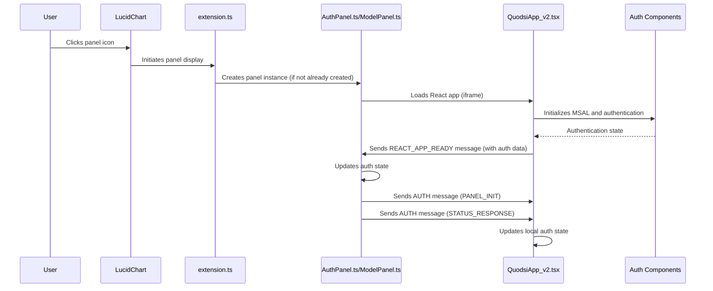

# Common Panel Initialization Flow

This document describes the common initialization flow that occurs when any Quodsi panel is displayed in the LucidChart editor. Both the AuthPanel and ModelPanel share this flow up to the point where the QuodsiApp.tsx component sends the REACT_APP_READY message.

## Flow Overview



## Detailed Process

### 1. Extension Initialization

When the LucidChart extension first loads, `extension.ts` initializes both the `AuthPanel` and `ModelPanel` components:

```typescript
// Initialize storage adapter
const storageAdapter = new StorageAdapter();

// Initialize core model management with storage adapter
const modelManager = new ModelManager(storageAdapter);

console.info('[extension] About to create AuthPanel');
const authPanel = new AuthPanel(client);
authPanel.setLogging(true);
console.info('[extension] Created AuthPanel');

console.info('[extension] About to create ModelPanel');
const modelPanel = new ModelPanel(client, modelManager);
modelPanel.setLogging(true);
console.info('[extension] Created ModelPanel');

// Register both panels with the panel manager for cross-panel communication
panelManager.registerAuthPanel(authPanel);
panelManager.registerModelPanel(modelPanel);
```

Both panel icons are visible in the LucidChart panel selector regardless of authentication state. This ensures a consistent UI experience for users.

### 2. Panel Loading

When the user clicks on either the Auth Panel or Model Panel icon, LucidChart initiates the panel display process:

1. The panel's `show()` method is called
2. The panel loads its iframe content pointing to the React application:
   ```typescript
   // From AuthPanel.ts or ModelPanel.ts constructor
   super(client, {
     title: 'Quodsi', // or 'Quodsi Model' for ModelPanel
     url: 'quodsim-react/index.html', // Same React app for both panels
     location: PanelLocation.ContentDock, // or RightDock for ModelPanel
     iconUrl: 'https://lucid.app/favicon.ico', 
     width: 300
   });
   ```

3. The panel's `frameLoaded()` method is called once the iframe has been constructed and loaded

### 3. React Application Initialization

The React application loads with the following initialization sequence:

1. **App.tsx**: Entry point that sets up the authentication providers
   ```typescript
   const App: React.FC = () => {
     // Create MSAL instance once using useMemo to avoid recreating on each render
     const msalInstance = useMemo(() => createMsalInstance(), []);

     return (
       <MsalInitializer msalInstance={msalInstance}>
         <AuthProvider msalInstance={msalInstance}>
           <QuodsiApp />
         </AuthProvider>
       </MsalInitializer>
     );
   };
   ```

2. **MsalInitializer.tsx**: Ensures MSAL is properly initialized before rendering children
   ```typescript
   useEffect(() => {
     const initializeMsal = async () => {
       try {
         // Step 1: Explicitly initialize MSAL first
         await msalInstance.initialize();
         
         // Step 2: AFTER initialization completes, handle any redirects
         await handleRedirectAfterInitialization(msalInstance);
         
         // Step 3: Mark as initialized
         setIsMsalInitialized(true);
       } catch (error) {
         setMsalError(error instanceof Error ? error : new Error(String(error)));
       }
     };

     initializeMsal();
   }, [msalInstance]);
   ```

3. **AuthProvider.tsx**: Provides authentication context to all components
   ```typescript
   const InnerAuthProvider: React.FC<{ children: React.ReactNode }> = ({ children }) => {
     // Use authentication hook to get auth state and functions
     const auth = useAuthentication();
     const { instance } = useMsal();
     
     // Initialize API service with the token getter
     useEffect(() => {
       try {
         ApiService.getInstance(auth.getAccessToken);
       } catch (error) {
         console.error('[AuthProvider] Failed to initialize API service', error);
       }
     }, [auth.getAccessToken, instance]);

     // Provide the auth state and functions to all child components
     return (
       <AuthContext.Provider value={{ /* auth state and functions */ }}>
         {children}
       </AuthContext.Provider>
     );
   };
   ```

4. **QuodsiApp_v2.tsx**: Main application component that:
   - Determines which panel it's running in (Auth or Model)
   - Sets up message handling
   - Maintains local authentication state separate from context
   - Renders the appropriate UI based on panel type and authentication state

### 4. Panel Type Detection

The React application needs to determine which panel it's running in:

```typescript
// Effect to try to detect panel type from URL parameters
useEffect(() => {
  // Only run if panelType is not set yet
  if (!state.panelType) {
    try {
      // Try to determine panel type from URL search params
      const urlParams = new URLSearchParams(window.location.search);
      const panelParam = urlParams.get("panel");

      if (panelParam) {
        // If panel parameter exists, use it
        const detectedType = panelParam.toLowerCase() === "auth" ? "auth" : "model";
        console.log(`[QuodsiApp_v2] Detected panel type '${detectedType}' from URL parameter`);

        setState((prev) => ({ ...prev, panelType: detectedType }));
      } else if (window.location.pathname.includes("auth")) {
        // Fallback to checking URL path
        console.log("[QuodsiApp_v2] Detected auth panel from URL path");
        setState((prev) => ({ ...prev, panelType: "auth" }));
      } else {
        // Default to model panel if we can't determine
        console.log("[QuodsiApp_v2] Defaulting to model panel");
        setState((prev) => ({ ...prev, panelType: "model" }));
      }
    } catch (error) {
      console.error("[QuodsiApp_v2] Error detecting panel type:", error);
    }
  }
}, []); // Only run once on mount
```

### 5. Local Authentication State Setup

QuodsiApp_v2 maintains local authentication state to improve reliability:

```typescript
// Using global auth context
const { isAuthenticated, userInfo } = useAuth();

// Local authentication state variables
const [userIsAuthenticated, setUserIsAuthenticated] = useState<boolean>(false);
const [localUserInfo, setLocalUserInfo] = useState<any>(null);

// Sync the auth context state to local state
useEffect(() => {
  if (isAuthenticated && userInfo) {
    console.log("[QuodsiApp_v2] Auth context updated to authenticated, syncing local state");
    setUserIsAuthenticated(true);
    setLocalUserInfo(userInfo);
  }
}, [isAuthenticated, userInfo]);
```

### 6. Direct Message Handling for Auth Updates

The React app sets up direct message handling for authentication updates:

```typescript
// Add an effect to handle auth updates from messaging
useEffect(() => {
  // Create a handler for AUTH messages to directly update local state
  const handleAuthMessage = (message: any) => {
    // Only process messages from our messaging library
    if (!message || !message.data || !message.data.messagetype) {
      return;
    }

    // Check for AUTH message with status response
    if (
      message.data.messagetype === "AUTH" &&
      message.data.data?.type === "status_response" &&
      message.data.data?.data?.isAuthenticated
    ) {
      console.log("[QuodsiApp_v2] Received direct AUTH update:", message.data.data.data);

      // Update local state directly
      setUserIsAuthenticated(true);
      setLocalUserInfo(message.data.data.data.userInfo || null);
    }
  };

  // Listen for messages
  window.addEventListener("message", handleAuthMessage);

  // Clean up
  return () => {
    window.removeEventListener("message", handleAuthMessage);
  };
}, []);
```

### 7. Message Service Setup

The React application sets up message handling via the MessageService:

```typescript
// Set up message handling
useEffect(() => {
  console.log("[QuodsiApp_v2] Setting up ExtensionMessaging");

  // Create the dependencies object for message handlers
  const messageDeps = {
    setState,
    setError: (error: string | null) =>
      setState((prev) => ({ ...prev, error })),
    sendMessage,
  };

  // Initialize message handling with dependencies
  const cleanup = messageService.current.initMessageHandling(messageDeps);

  // Create the authentication data to include with REACT_APP_READY
  const authData = {
    panelType: state.panelType || undefined, // Convert null to undefined to match the type
    isAuthenticated: isAuthenticated,
    userInfo: userInfo || undefined,
  };

  // Send the REACT_APP_READY message with auth data
  messageService.current.sendAppReadyMessage(authData);

  // Set up action handlers with refreshed dependencies
  actionHandlers.current = createActionHandlers(setState, getState);

  // Return cleanup function
  return cleanup;
}, [sendMessage, isAuthenticated, userInfo, state.panelType, getState]);
```

### 8. REACT_APP_READY Message

The key shared step is sending the `REACT_APP_READY` message with authentication data:

```typescript
public sendAppReadyMessage(authData: any): void {
  ComponentLogger.log(LOG_PREFIX, 'Sending REACT_APP_READY with auth data:', {
    panelType: authData.panelType || undefined,
    isAuthenticated: authData.isAuthenticated,
    hasUserInfo: !!authData.userInfo,
  });

  this.sendMessage(MessageTypes.REACT_APP_READY, authData);
}
```

This message includes:
- Which panel is currently active (`panelType`)
- Current authentication state (`isAuthenticated`)
- User information if authenticated (`userInfo`)

### 9. Panel Receives REACT_APP_READY

Both panels have a handler for REACT_APP_READY that processes authentication data:

```typescript
this.messaging.onMessage(MessageTypes.REACT_APP_READY, (payload) => {
    this.log('REACT_APP_READY message received with payload:', payload);
    
    // Check if the message includes authentication data
    if (payload && typeof payload.isAuthenticated === 'boolean') {
        this.log('Received auth state from React app:', {
            isAuthenticated: payload.isAuthenticated,
            hasUserInfo: !!payload.userInfo
        });
        
        // Update our authentication state if needed
        if (payload.isAuthenticated) {
            this.log('Updating panel auth state from React app');
            this.isAuthenticated = payload.isAuthenticated;
            this.userInfo = payload.userInfo || null;
        }
    }
    
    this.handleReactReady();
});
```

### 10. Panel Initialization Messages

After processing REACT_APP_READY, the panel sends initialization messages to React:

```typescript
// Send panel type initialization
this.sendAuthMessage(AuthActionType.PANEL_INIT, {
    panelType: 'auth' // or 'model' for ModelPanel
});

// Send current authentication state
this.sendAuthMessage(AuthActionType.STATUS_RESPONSE, {
    isAuthenticated: this.isAuthenticated,
    userInfo: this.userInfo || undefined
});
```

The React app processes these messages through its message handlers, updating component state accordingly.

### 11. UI Rendering Based on Authentication

Finally, QuodsiApp_v2.tsx renders the appropriate UI based on the panel type and authentication state:

```typescript
return (
  <div className="flex flex-col h-screen">
    {state.error && <ErrorDisplay error={state.error} />}

    {isLoading ? (
      // Show a loading spinner while initializing
      <ProcessingIndicator message="Initializing Quodsi..." fullScreen={true} />
    ) : state.panelType === "auth" ? (
      // Show the Auth Panel when panelType is "auth"
      <AuthPanel />
    ) : // For ModelPanel, check authentication state
    inProgress !== "none" ? (
      // Show loading while MSAL is initializing
      <ProcessingIndicator message="Initializing authentication..." fullScreen={true} />
    ) : !userIsAuthenticated ? ( // Use local auth state instead of context
      // Not authenticated - show sign-in message
      <div className="flex flex-col items-center justify-center h-full p-4 bg-gray-50">
        <div className="text-center max-w-md p-6 bg-white rounded-lg shadow-sm">
          <h2 className="text-xl font-semibold text-gray-800 mb-3">
            Authentication Required
          </h2>
          <p className="text-gray-600 mb-4">
            Please sign in to access the Quodsi simulation modeling tools.
          </p>
          <button
            className="px-4 py-2 bg-blue-500 text-white rounded hover:bg-blue-600 transition-colors"
            onClick={actionHandlers.current.handleRedirectToAuthPanel}
          >
            Sign In
          </button>
        </div>
      </div>
    ) : (
      // Authenticated - show ModelPanelAccordion with processing indicator when needed
      <>
        {state.isProcessing && (
          <div className="absolute top-0 left-0 right-0 z-10">
            <ProcessingIndicator message="Processing..." />
          </div>
        )}
        <ModelPanelAccordion
          modelName={state.modelName}
          validationState={state.validationState}
          currentElement={state.currentElement}
          lastElementUpdate={state.lastElementUpdate}
          diagramElementType={state.diagramElementType}
          onValidate={actionHandlers.current.handleValidate}
          onElementUpdate={actionHandlers.current.handleElementUpdate}
          referenceData={state.referenceData}
          showModelName={state.showModelName}
          showModelItemName={state.showModelItemName}
          visibleSections={state.visibleSections}
          onSimulate={actionHandlers.current.handleSimulate}
          onRemoveModel={actionHandlers.current.handleRemoveModel}
          onConvertPage={actionHandlers.current.handleConvertPage}
          onElementTypeChange={actionHandlers.current.handleElementTypeChange}
          simulationStatus={state.simulationStatus}
          onViewResults={handleViewResults}
          needsInitialization={state.needsInitialization}
        />
      </>
    )}
  </div>
);
```

Note that for the ModelPanel, it uses `userIsAuthenticated` (local state) rather than `isAuthenticated` (context state) to determine whether to show the authentication message or model content.

From this point, the AuthPanel and ModelPanel handling diverges based on the specific panel type, which is covered in the separate documents.

## Cross-Panel Authentication Update Flow

When authentication status changes in one panel (typically the AuthPanel), the change is propagated to other panels:

1. User signs in via AuthPanel
2. AuthPanel.ts receives AUTH COMPLETED message
3. AuthPanel.ts calls `panelManager.resetModelPanelAuthentication()`
4. PanelManager calls `modelPanel.resetAuthentication()`
5. ModelPanel.ts sends RECHECK_AUTH message to its React instance
6. AuthMessagingService in React handles RECHECK_AUTH:
   ```typescript
   private handleRecheckAuth(): void {
     // Get MSAL instance and check for accounts
     const msalInstance = getMsalInstanceFromContext();
     if (!msalInstance) return;
     
     const currentAccounts = msalInstance.getAllAccounts();
     
     if (currentAccounts.length > 0) {
       // User is authenticated, update state
       const account = currentAccounts[0];
       const userInfo = {
         name: account.name || "Unknown User",
         email: account.username,
       };
       
       // Update global auth state via callback
       if (this.authStateUpdateCallback) {
         this.authStateUpdateCallback(true, userInfo);
       }
       
       // Broadcast auth status to extension
       this.broadcastAuthStatus(true, userInfo);
     }
   }
   ```
7. Auth update callback in useAuthentication updates auth context state
8. The direct message handler in QuodsiApp_v2 updates local auth state
9. QuodsiApp_v2 re-renders with authenticated UI for ModelPanel