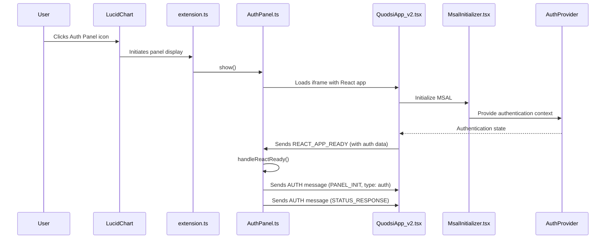

# AuthPanel to REACT_APP_READY Flow

This document describes the application code flow starting with `extension.ts` and the user clicking to show the AuthPanel, leading to QuodsiApp.tsx sending the REACT_APP_READY message and the handling by the AuthPanel.

## Flow Diagram



## Detailed Process

### 1. Extension Initialization

When the LucidChart extension first loads, `extension.ts` initializes the AuthPanel:

```typescript
console.info('[extension] About to create AuthPanel');
const authPanel = new AuthPanel(client);
authPanel.setLogging(true);
console.info('[extension] Created AuthPanel');
```

The AuthPanel constructor sets up basic configuration and initializes properties:

```typescript
constructor(client: EditorClient) {
    super(client, {
        title: 'Quodsi',
        url: 'quodsim-react/index.html',
        location: PanelLocation.ContentDock,
        iconUrl: 'https://lucid.app/favicon.ico',
        width: 300
    });
    this.log('Auth Panel Constructor called');
    this.messaging = ExtensionMessaging.getInstance();
    this.setupMessageHandlers();
    this.loadSessionState();
    this.log('Auth Panel initialized');
}
```

### 2. User Clicks Auth Panel Icon

When the user clicks the Auth Panel icon in the LucidChart panel selector:

1. LucidChart initiates the panel display by calling the `show()` method
2. The AuthPanel loads its iframe content pointing to the React application:
   ```typescript
   // From AuthPanel.ts constructor
   super(client, {
     title: 'Quodsi',
     url: 'quodsim-react/index.html',
     location: PanelLocation.ContentDock,
     iconUrl: 'https://lucid.app/favicon.ico',
     width: 300
   });
   ```

3. The AuthPanel's `frameLoaded()` method is called once the iframe has been constructed and loaded:
   ```typescript
   protected frameLoaded(): void {
       this.log('AuthPanel frame loaded');
       super.frameLoaded();
       
       // Send panel type initialization message immediately when the frame loads
       if (this.reactAppReady) {
           this.sendAuthMessage(AuthActionType.PANEL_INIT, {
               panelType: 'auth'
           });
           
           // Also send auth status if authenticated
           if (this.isAuthenticated && this.userInfo) {
               this.sendAuthMessage(AuthActionType.STATUS_RESPONSE, {
                   isAuthenticated: this.isAuthenticated,
                   userInfo: this.userInfo
               });
           }
       }
   }
   ```

### 3. React Application Initialization

The React application loads with the initialization sequence covered in the common initialization flow document. Key components for authentication include:

1. **App.tsx**: Entry point that sets up the authentication providers
2. **MsalInitializer.tsx**: Ensures MSAL is properly initialized before rendering children
3. **AuthProvider.tsx**: Provides authentication context to all components
4. **QuodsiApp_v2.tsx**: Main application component that determines which panel it's in and renders accordingly

During initialization, QuodsiApp_v2.tsx attempts to determine which panel it's running in:

```typescript
// Default to auth panel if path contains 'auth'
panelType: window.location.pathname.includes("auth") ? "auth" : null,

// Effect to try to detect panel type from URL parameters
useEffect(() => {
  // Only run if panelType is not set yet
  if (!state.panelType) {
    try {
      // Try to determine panel type from URL search params
      const urlParams = new URLSearchParams(window.location.search);
      const panelParam = urlParams.get("panel");

      if (panelParam) {
        // If panel parameter exists, use it
        const detectedType = panelParam.toLowerCase() === "auth" ? "auth" : "model";
        console.log(`[QuodsiApp_v2] Detected panel type '${detectedType}' from URL parameter`);

        setState((prev) => ({ ...prev, panelType: detectedType }));
      } else if (window.location.pathname.includes("auth")) {
        // Fallback to checking URL path
        console.log("[QuodsiApp_v2] Detected auth panel from URL path");
        setState((prev) => ({ ...prev, panelType: "auth" }));
      } else {
        // Default to model panel if we can't determine
        console.log("[QuodsiApp_v2] Defaulting to model panel");
        setState((prev) => ({ ...prev, panelType: "model" }));
      }
    } catch (error) {
      console.error("[QuodsiApp_v2] Error detecting panel type:", error);
    }
  }
}, []); // Only run once on mount
```

### 4. REACT_APP_READY Message

Once the React application is initialized, QuodsiApp_v2.tsx sends the `REACT_APP_READY` message with authentication data:

```typescript
// Create the authentication data to include with REACT_APP_READY
const authData = {
  panelType: state.panelType || undefined,
  isAuthenticated: isAuthenticated,
  userInfo: userInfo || undefined,
};

// Send the REACT_APP_READY message with auth data
messageService.current.sendAppReadyMessage(authData);
```

The actual message sending is implemented in the MessageService:

```typescript
public sendAppReadyMessage(authData: any): void {
  ComponentLogger.log(LOG_PREFIX, 'Sending REACT_APP_READY with auth data:', {
    panelType: authData.panelType || undefined,
    isAuthenticated: authData.isAuthenticated,
    hasUserInfo: !!authData.userInfo,
  });

  this.sendMessage(MessageTypes.REACT_APP_READY, authData);
}
```

### 5. AuthPanel Receives REACT_APP_READY

The AuthPanel has a handler set up to process `REACT_APP_READY` messages with authentication data:

```typescript
this.messaging.onMessage(MessageTypes.REACT_APP_READY, (payload) => {
    this.log('REACT_APP_READY message received in auth panel with payload:', payload);

    // Check if the message includes authentication data
    if (payload && typeof payload.isAuthenticated === 'boolean') {
        this.log('Received auth state from React app:', {
            isAuthenticated: payload.isAuthenticated,
            hasUserInfo: !!payload.userInfo
        });

        // Update our authentication state if needed
        if (payload.isAuthenticated && !this.isAuthenticated) {
            this.log('Updating panel auth state from React app');
            this.isAuthenticated = payload.isAuthenticated;
            this.userInfo = payload.userInfo || null;

            // Save the updated state to session storage
            this.saveSessionState();
        }
    } else {
        this.log('No auth data in REACT_APP_READY message, loading from session');
        // When the React app is ready, check if we need to reload session state
        // This ensures we have fresh state when the panel is reopened
        this.loadSessionState();
    }

    this.handleReactReady();
});
```

### 6. AuthPanel handleReactReady()

Once the AuthPanel processes the `REACT_APP_READY` message, it calls `handleReactReady()`:

```typescript
private async handleReactReady(): Promise<void> {
    this.log('handleReactReady in AuthPanel');
    
    // If the app was already initialized, we're likely reopening the panel
    // We still need to send the initialization messages
    if (this.reactAppReady) {
        this.log('React app already ready, but panel might be reopening - sending init messages');
    }
    
    this.reactAppReady = true;

    // Tell React this is the AuthPanel
    this.sendAuthMessage(AuthActionType.PANEL_INIT, {
        panelType: 'auth'
    });
    
    // Always send the auth status, whether authenticated or not
    // This ensures the React app has the current state
    this.sendAuthMessage(AuthActionType.STATUS_RESPONSE, {
        isAuthenticated: this.isAuthenticated,
        userInfo: this.userInfo || undefined
    });
    
    this.log('Sent auth panel init with authentication state:', { 
        isAuthenticated: this.isAuthenticated,
        hasUserInfo: !!this.userInfo 
    });
}
```

This method sends two key messages back to the React application:

1. `AUTH` message with `PANEL_INIT` action type - tells React this is the AuthPanel
2. `AUTH` message with `STATUS_RESPONSE` action type - sends the current authentication state

### 7. React Application Receives AUTH Messages

The React application processes these messages and updates its state accordingly:

- For `PANEL_INIT`, it confirms it's running in the AuthPanel
- For `STATUS_RESPONSE`, it updates its authentication state UI

### 8. UI Rendering Based on Panel Type

Finally, QuodsiApp_v2.tsx renders the appropriate UI based on the panel type:

```typescript
return (
  <div className="flex flex-col h-screen">
    {state.error && <ErrorDisplay error={state.error} />}

    {silentAuthInProgress ? (
      // Show a loading spinner while initializing
      <ProcessingIndicator message="Initializing Quodsi..." fullScreen={true} />
    ) : state.panelType === "auth" ? (
      // Show the Auth Panel when panelType is "auth"
      <AuthPanel />
    ) : // For ModelPanel, check if MSAL is initializing, then check auth status
    // ... rest of the conditional rendering logic
  </div>
);
```

For the AuthPanel, it renders the `<AuthPanel />` component which displays the authentication UI where users can sign in or sign out.

## Session Management

An important aspect of the AuthPanel flow is session state management:

```typescript
private loadSessionState(): void {
    try {
        // Check if we have auth state in session storage
        const authState = this.getSessionItem(SESSION_AUTH_STATE);
        const userInfoStr = this.getSessionItem(SESSION_USER_INFO);
        const lastActiveStr = this.getSessionItem(SESSION_LAST_ACTIVE);
        
        if (authState && userInfoStr && lastActiveStr) {
            const isAuthenticated = authState === 'true';
            const userInfo = JSON.parse(userInfoStr) as UserInfo;
            const lastActive = parseInt(lastActiveStr, 10);
            
            // Check if the session is still valid (not timed out)
            const now = Date.now();
            if (now - lastActive < SESSION_TIMEOUT) {
                this.isAuthenticated = isAuthenticated;
                this.userInfo = userInfo;
                this.updateLastActive();
                this.log('Loaded valid session state from storage', {
                    isAuthenticated,
                    userInfo
                });
            } else {
                // Session has timed out
                this.log('Session has timed out, clearing state');
                this.clearSessionState();
            }
        } else {
            this.log('No session state found in storage');
        }
    } catch (error) {
        this.logError('Error loading session state', error);
        this.clearSessionState();
    }
}
```

This allows the AuthPanel to:
1. Persist authentication state between panel openings
2. Automatically log users out after a period of inactivity
3. Synchronize authentication state with the React application

## Key Points About AuthPanel Flow

1. **Single React Application**: Both AuthPanel and ModelPanel use the same React application (`quodsim-react/index.html`), which determines which panel UI to show based on context.

2. **Early Authentication State Sharing**: The `REACT_APP_READY` message includes authentication data, ensuring both panels receive authentication state immediately when React initializes.

3. **Session State Persistence**: AuthPanel maintains authentication state in session storage with fallbacks, allowing it to restore state when the panel is reopened.

4. **Two-Way Communication**: 
   - React app sends its state to AuthPanel via `REACT_APP_READY`
   - AuthPanel sends its state to React via `AUTH` messages with various action types

5. **Consolidated Messaging System**: Uses a unified message handling approach with type discrimination:
   ```typescript
   this.sendAuthMessage(AuthActionType.PANEL_INIT, {
       panelType: 'auth'
   });
   ```

This architecture allows for robust authentication handling in the LucidChart extension environment, properly managing the complexities of iframes, session persistence, and cross-panel communication.
