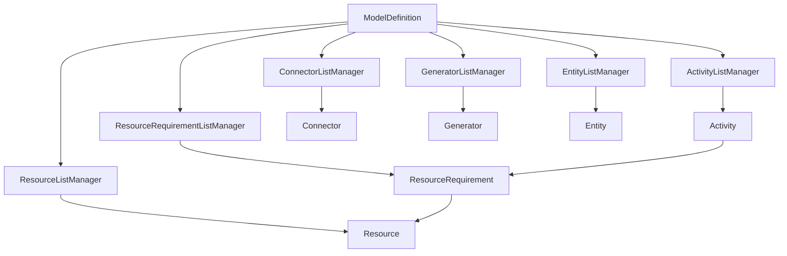

# Elements - Core Simulation Types

This directory contains the core types that represent simulation objects within Quodsi. The ModelDefinition serves as the central coordinator, managing collections of simulation elements through specialized ListManager classes.

## ModelDefinition

ModelDefinition is the root class that represents a complete simulation model. It manages:
- Collections of simulation elements (Activities, Resources, etc.)
- Simulation parameters and settings
- Model metadata

```typescript
class ModelDefinition {
    id: string;
    name: string;
    reps: number;
    forecastDays: number;
    seed: number;
    oneClockUnit: TimeUnit;
    simulationTimeType: SimulationTimeType;
    // ... additional properties
}
```

### Key Features
- Manages all simulation elements through ListManagers
- Handles time-related settings (clock units, periods)
- Controls simulation parameters (reps, seed)
- Coordinates element relationships

## List Managers

ModelDefinition uses specialized ListManager classes to maintain collections of each element type:

```
ActivityListManager       → Manages Activity elements
ConnectorListManager     → Manages Connector elements
ResourceListManager      → Manages Resource elements
GeneratorListManager     → Manages Generator elements
EntityListManager        → Manages Entity elements
ResourceRequirementListManager → Manages ResourceRequirement elements
```

Each ListManager provides:
- Element addition/removal
- Element lookup
- Validation
- Relationship management

## Element Types

### Activity
Represents a process or operation:
- Processing steps
- Resource requirements
- Buffer capacities
- Routing logic

### Connector
Represents flow between elements:
- Source and target connections
- Flow logic
- Routing rules

### Resource
Represents operational resources:
- Capacity
- Availability
- Skills/capabilities
- Cost factors

### Generator
Creates entities in the simulation:
- Generation patterns
- Entity types
- Timing rules
- Distribution settings

### Entity
Represents items flowing through the system:
- Attributes
- Statistics
- State information

### ResourceRequirement
Defines resource needs:
- Requirement clauses
- Resource requests
- Quantity specifications
- Duration rules

## Relationships



## Usage Example

```typescript
// Create a new model
const model = new ModelDefinition({
    id: "model1",
    name: "Production Line",
    reps: 10,
    forecastDays: 30
});

// Add an activity
const activity = model.activities.add({
    id: "activity1",
    name: "Assembly",
    capacity: 1
});

// Add a resource
const resource = model.resources.add({
    id: "resource1",
    name: "Worker",
    capacity: 5
});

// Link resource to activity
const requirement = model.resourceRequirements.add({
    id: "req1",
    activityId: activity.id,
    resourceId: resource.id,
    quantity: 1
});
```

## Platform Independence

These types are platform-agnostic and serve as the core data model. Platform-specific implementations (like LucidChart) provide their own mappings to these core types.

## Validation

Each type includes validation rules:
- Required properties
- Value ranges
- Relationship integrity
- Logic consistency

## Best Practices

1. **Model Structure**
   - Always create elements through ModelDefinition
   - Maintain referential integrity
   - Validate relationships

2. **ListManagers**
   - Use provided methods for element manipulation
   - Handle events appropriately
   - Maintain consistency

3. **Elements**
   - Set all required properties
   - Validate inputs
   - Maintain clean relationships

4. **Versioning**
   - Handle version changes appropriately
   - Maintain backward compatibility when needed
   - Document changes